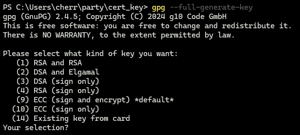
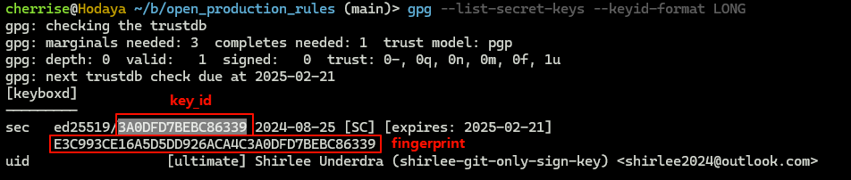
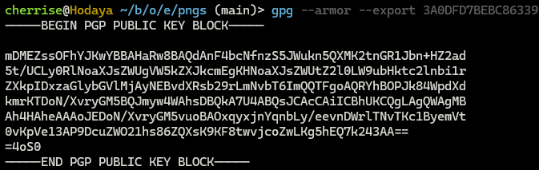

#### generate key
<div>

</div>

#### gpg --list-secret-keys --keyid-format LONG


gpg --list-secret-keys --keyid-format LONG
gpg --armor --export <key-id>
# it will show PUBLIC KEY

git config --global user.signingkey 0D713F79D3508435
git config --global commit.gpgsign true


problem about:
Could not open a connection to your authentication agent
question:
how to add a key to gpg-agent


problem about:
gpg --card-status

gpg: selecting card failed: Service is not running
gpg: OpenPGP card not available: Service is not running


### gpgconf --list-dirs agent-socket
This command will display the directory where the GPG agent's socket file is located. If the GPG agent is running, this command will output the path to the agent's socket file. If the GPG agent is not running, it will not display any output.

If you see a path to the agent's socket file, it means that the GPG agent is running. If you don't see any output, it means that the GPG agent is not 
running.

```bash
gpg --list-secret-keys --keyid-format LONG
git commit -S -m "Your commit message"
```

<div>

</div>

```bash

git config --global user.signingkey <key-id>

```
Configure Your GitHub Account
If you're using GitHub, you'll also need to upload your GPG public key to your GitHub account to verify signed commits:

Export your GPG public key:

<div>

</div>

```bash
gpg --armor --export <key-id>
```

### problem about:
 error: gpg failed to sign the data:


 git config --global gpg.program gpg

Solution:
If gnupg2 and gpg-agent 2.x are used, be sure to set the environment variable GPG_TTY.

export GPG_TTY=$(tty)


ssh-agent -s
ssh-add github_ed25519-sk_SFDN4125
ssh-add -l
// output
256 SHA256:p7qrlQqJGIRiDf0CBBY+yYf5a46/qWU0kBxE48gmS7c only for cherry1635 github repo clone and push (ED25519)